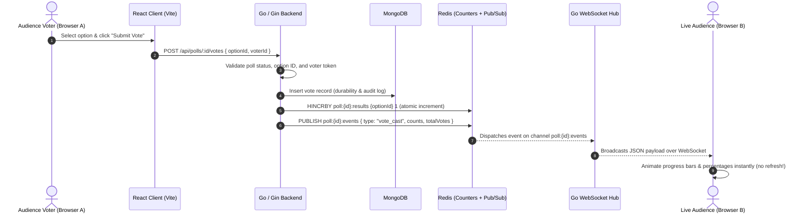

# PulsePoll

> **Production-Grade Live Polling Tool with Real-Time Redis Pub/Sub, WebSockets, Go (Gin), MongoDB, and React (TypeScript).**

---

## 1. Overview & Flow

PulsePoll is a full-stack, distributed live polling engine designed for conferences, presentations, all-hands meetings, and classrooms. It follows this continuous real-time flow:

```
Create Poll → Share Link / QR Code → Audience Votes → Results Update Instantly Across All Devices
```

- **Audience users** can open any public poll link (`/poll/:id` or `/?poll=:id`) from mobile or desktop and vote with one tap—**no registration required**.
- **Poll creators** can sign up, log in, create polls with custom options, share instant QR codes, track live metrics in a creator dashboard, and close polls when voting ends.
- **Real-Time Synchronicity**: When a vote is cast, WebSocket subscribers across all client browsers receive updated counts within milliseconds without page refreshes.

---

## 2. Tech Stack

| Tier | Technology | Purpose |
| :--- | :--- | :--- |
| **Frontend** | **React 19 + TypeScript + Vite** | Component architecture, client-side routing, typed models |
| **Styling & UI** | **Tailwind CSS + Lucide Icons + Motion** | Responsive design, live progress bar transitions, dark theme |
| **Realtime** | **Native WebSockets + Redis Pub/Sub** | Sub-10ms event distribution across horizontally scaled nodes |
| **Backend** | **Go (Golang 1.22) + Gin Web Framework** | High-throughput concurrent REST API & WebSocket connection manager |
| **Database** | **MongoDB 7.0** | Durable persistent storage of users, polls, metadata, and votes |
| **In-Memory** | **Redis 7.2** | Atomic live vote counters (`HINCRBY`) & Pub/Sub event channels |
| **Container** | **Docker & Docker Compose** | Multi-container local development & production orchestration |

---

## 3. Realtime Architecture & System Diagram

Redis is **not** a passive cache in PulsePoll—it actively powers the live vote counting and event distribution pipeline.

### Mermaid Flowchart



### Why This Architecture?
1. **Zero Race Conditions**: Redis processes commands sequentially on a single thread. Using `HINCRBY poll:{id}:results {optionId} 1` ensures that 1,000 simultaneous voters never overwrite each other's increments.
2. **Horizontal Scalability via Redis Pub/Sub**: If the backend runs across 4 Go instances behind an AWS ALB or Cloud Run load balancer, client A and client B can be connected to different instances. Redis Pub/Sub bridges all instances so every connected client receives the broadcast.
3. **Graceful Fallback**: If Redis restarts, the Go backend queries MongoDB's aggregation pipeline (`$group` by `optionId`) to recalculate accurate counts and warm up the Redis hash.

---

## 4. Project Structure

PulsePoll adheres to clean architecture principles with complete separation of concerns:

```
pulsepoll/
├── backend/                        # Go (Gin) Production Backend
│   ├── cmd/
│   │   └── server/
│   │       └── main.go             # Server startup, graceful shutdown, DI
│   ├── internal/
│   │   ├── auth/                   # JWT generation, claim parsing, bcrypt
│   │   ├── config/                 # Environment variable loading
│   │   ├── handlers/               # Gin HTTP & WebSocket route handlers
│   │   ├── middleware/             # JWT auth guard, CORS, logging
│   │   ├── models/                 # BSON & JSON data models
│   │   ├── mongodb/                # Mongo client & index initializer
│   │   ├── redis/                  # Redis client, HINCRBY counters, Pub/Sub
│   │   ├── repositories/           # Mongo CRUD interfaces & implementations
│   │   ├── services/               # Core business logic & validations
│   │   ├── validation/             # Input format & bounds validators
│   │   └── websocket/              # Gorilla WebSocket hub, client pumps
│   ├── routes/
│   │   └── routes.go               # Gin routing table
│   ├── tests/                      # Go unit tests (auth, validation, polls)
│   ├── Dockerfile                  # Multi-stage Alpine Go Dockerfile
│   └── go.mod                      # Go dependencies module
│
├── src/                            # React 19 + TypeScript Frontend
│   ├── components/                 # Reusable UI components
│   │   ├── ArchitectureDocsModal.tsx # In-app tech specs & interview guide
│   │   ├── LiveResultsBar.tsx      # Smooth animated progress bars
│   │   ├── Navbar.tsx              # Brand bar with live pulse dot
│   │   ├── PollCard.tsx            # Poll card for feed and dashboard
│   │   ├── ShareModal.tsx          # Copy link & native SVG QR Code
│   │   └── Toast.tsx               # Floating feedback alerts
│   ├── context/
│   │   ├── AuthContext.tsx         # JWT token management & session check
│   │   └── ToastContext.tsx        # Toast dispatch provider
│   ├── hooks/
│   │   └── usePollSocket.ts        # Reusable WebSocket client hook
│   ├── pages/
│   │   ├── CreatePollPage.tsx      # Poll creation with dynamic options
│   │   ├── DashboardPage.tsx       # Creator dashboard with metrics
│   │   ├── LandingPage.tsx         # Hero, public feed, feature highlights
│   │   ├── LoginPage.tsx           # Authentication login form
│   │   ├── PublicPollPage.tsx      # Public voting & live animated results
│   │   └── SignupPage.tsx          # Account registration form
│   ├── services/
│   │   └── api.ts                  # REST API client & voter token helper
│   ├── types.ts                    # Shared TypeScript interfaces
│   ├── App.tsx                     # Top-level view router & state
│   ├── index.css                   # Tailwind CSS styling & scrollbars
│   └── main.tsx                    # React DOM entrypoint
│
├── server.ts                       # Full-Stack Node/TypeScript server for AI Studio
├── docker-compose.yml              # Multi-container Compose config
├── Dockerfile.frontend             # Nginx static server for production
├── index.html                      # HTML5 entrypoint with Plus Jakarta Sans
├── package.json                    # Frontend dependencies & build scripts
└── README.md                       # Comprehensive documentation
```

---

## 5. Environment Variables

Create `.env` in the root (or `backend/.env`):

```env
# Server & Port
PORT=8080
ENV=development

# MongoDB Connection
MONGODB_URI=mongodb://localhost:27017/pulsepoll
MONGODB_DATABASE=pulsepoll

# Redis Connection
REDIS_URL=redis://localhost:6379

# Security & JWT
JWT_SECRET=pulsepoll-super-secret-jwt-key-change-in-production-2026

# Frontend Configuration
FRONTEND_URL=http://localhost:3000
```

---

## 6. Local Setup & Running

### Prerequisites
- Node.js (v20+) and npm
- Go (v1.22+)
- Docker & Docker Compose (optional, for 1-command startup)

### Option A: Running with Docker Compose (Fastest)

```bash
# Clone the repository
git clone https://github.com/pulsepoll/pulsepoll.git
cd pulsepoll

# Start MongoDB, Redis, Go Backend, and React Frontend together
docker compose up --build
```
- Open `http://localhost:3000` to interact with the application.
- The Go backend will be running on `http://localhost:8080`.

### Option B: Running Natively

#### 1. Start MongoDB and Redis
```bash
# Start MongoDB (port 27017)
mongod --dbpath ./data/db

# Start Redis (port 6379)
redis-server
```

#### 2. Run the Go Backend
```bash
cd backend
go mod download
go run ./cmd/server
```

#### 3. Run the React Frontend
```bash
# In the project root
npm install
npm run dev
```
Visit `http://localhost:3000`.

---

## 7. REST API Documentation

### Authentication Endpoints

#### 1. Sign Up
- **Method / Path**: `POST /api/auth/signup`
- **Auth**: Public
- **Request Body**:
  ```json
  {
    "email": "sarah@example.com",
    "password": "securepassword123",
    "name": "Sarah Connor"
  }
  ```
- **Response `201 Created`**:
  ```json
  {
    "success": true,
    "data": {
      "user": {
        "id": "65f812a4b89e3a1234567890",
        "email": "sarah@example.com",
        "name": "Sarah Connor",
        "createdAt": "2026-09-19T07:00:00Z"
      },
      "token": "eyJhbGciOiJIUzI1NiIsInR5cCI6IkpXVCJ9..."
    },
    "error": null
  }
  ```

#### 2. Log In
- **Method / Path**: `POST /api/auth/login`
- **Auth**: Public
- **Request Body**:
  ```json
  {
    "email": "sarah@example.com",
    "password": "securepassword123"
  }
  ```
- **Response `200 OK`**: Returns user profile and signed JWT token.

#### 3. Current User (`/me`)
- **Method / Path**: `GET /api/auth/me`
- **Auth**: `Bearer <token>`
- **Response `200 OK`**: Returns authenticated user profile.

---

### Poll Endpoints

#### 4. List Public Polls
- **Method / Path**: `GET /api/polls`
- **Auth**: Public
- **Response `200 OK`**: Array of poll objects with live vote counts.

#### 5. Get Poll by ID
- **Method / Path**: `GET /api/polls/:id`
- **Auth**: Public
- **Response `200 OK`**:
  ```json
  {
    "success": true,
    "data": {
      "id": "65f812a4b89e3a1234567891",
      "ownerId": "65f812a4b89e3a1234567890",
      "question": "Which cloud provider do you prefer for microservices?",
      "options": [
        { "id": "opt_1_7a9f8b", "text": "Google Cloud (Cloud Run)" },
        { "id": "opt_2_3c2d1e", "text": "AWS (ECS / EKS)" }
      ],
      "status": "active",
      "counts": { "opt_1_7a9f8b": 18, "opt_2_3c2d1e": 12 },
      "totalVotes": 30,
      "createdAt": "2026-09-19T07:15:00Z"
    },
    "error": null
  }
  ```

#### 6. Create Poll
- **Method / Path**: `POST /api/polls`
- **Auth**: `Bearer <token>`
- **Request Body**:
  ```json
  {
    "question": "What is your primary programming language for backend?",
    "options": ["Go", "Rust", "TypeScript", "Python"]
  }
  ```
- **Validation**:
  - `question`: Required, 5–200 characters.
  - `options`: 2–10 options, each 1–100 characters, no duplicates.

#### 7. Cast a Vote
- **Method / Path**: `POST /api/polls/:id/votes`
- **Auth**: Public
- **Request Body**:
  ```json
  {
    "optionId": "opt_1_7a9f8b",
    "voterId": "voter_9x8a7b6c5d"
  }
  ```
- **Response `201 Created`**:
  ```json
  {
    "success": true,
    "data": {
      "success": true,
      "counts": { "opt_1_7a9f8b": 19, "opt_2_3c2d1e": 12 },
      "totalVotes": 31
    },
    "error": null
  }
  ```
- **Error Codes**:
  - `400 Bad Request`: Poll is closed or invalid option ID.
  - `404 Not Found`: Poll does not exist.
  - `409 Conflict`: Already voted from this voter ID.

#### 8. Close Poll
- **Method / Path**: `POST /api/polls/:id/close`
- **Auth**: `Bearer <token>` (Owner only)
- **Response `200 OK`**: Marks poll status as `closed`, records `closedAt`, and broadcasts `poll_closed` event to all live WebSocket viewers.

---

### WebSocket Real-time Endpoint

#### 9. Connect to Live Poll Stream
- **Path**: `GET /api/ws/polls/:id` (or `/ws/polls/:id`)
- **Protocol**: `ws://` or `wss://`
- **Initial Message Received**:
  ```json
  {
    "type": "initial_state",
    "pollId": "65f812a4b89e3a1234567891",
    "counts": { "opt_1": 12, "opt_2": 8 },
    "totalVotes": 20,
    "status": "active"
  }
  ```
- **Live Broadcast Event (upon vote)**:
  ```json
  {
    "type": "vote_cast",
    "pollId": "65f812a4b89e3a1234567891",
    "optionId": "opt_1",
    "counts": { "opt_1": 13, "opt_2": 8 },
    "totalVotes": 21,
    "timestamp": "2026-09-19T07:22:15Z"
  }
  ```

---

## 8. Database Design & Indexes

PulsePoll utilizes MongoDB with automated index creation on server startup (`ensureIndexes`):

1. **`users` Collection**:
   - `email`: `String`, unique index (`{ email: 1 }, { unique: true }`)
   - `passwordHash`: `String` (Bcrypt, 12 rounds)
   - `createdAt`: `Date`
2. **`polls` Collection**:
   - `ownerId`: `ObjectId`, index (`{ ownerId: 1 }`) for fast creator queries
   - `question`: `String`
   - `options`: Array of `{ id: String, text: String }`
   - `status`: `"active"` or `"closed"`
   - `createdAt`, `updatedAt`, `closedAt`
3. **`votes` Collection**:
   - `pollId`: `ObjectId`, index (`{ pollId: 1 }`)
   - Compound Index: `{ pollId: 1, voterId: 1 }` for fast duplicate vote prevention
   - `optionId`: `String`
   - `createdAt`: `Date`

---

## 9. Duplicate Voting Strategy

For public audience voting without requiring user registration:
1. **Client-Side Storage**: The selected option is stored in `localStorage` (`pulsepoll_voted_{pollId}`) to immediately render the voted state and prevent duplicate clicks.
2. **Cryptographic Voter Identifier**: Each browser instance creates and stores a persistent anonymous voter token (`voter_{random}_{timestamp}`).
3. **Backend Compound Enforcement**: The backend verifies if `(pollId, voterId)` exists in MongoDB. If found, it rejects the request with HTTP `409 Conflict`.
4. **Tradeoff**: While an advanced user can clear local storage or use incognito tabs, this provides a frictionless, zero-friction audience experience without intrusive identity capture.

---

## 10. Testing

### Run Backend Tests
```bash
cd backend
go test -v ./tests/...
go vet ./...
```

### Test Coverage Includes:
- Password hashing and constant-time verification
- JWT signing, claim validation, and signature verification with incorrect secrets
- Email format validation
- Poll input validation (length limits, minimum option count, case-insensitive duplicates)

---

## 11. Technical Interview Preparation Guide

Here are detailed, architecturally grounded answers to key interview questions regarding this application:

### 1. Why MongoDB?
MongoDB provides schema flexibility for nested poll options while maintaining ACID guarantees on single-document operations. Its native aggregation framework allows fast fallback computation of vote counts (`$match` → `$group`) if in-memory caches ever require resynchronization.

### 2. Why Redis?
Relational or document databases require disk I/O, lock contention, and index maintenance for every write. When hundreds of audience members vote in a 10-second window, hitting MongoDB for every count increment creates a bottleneck. Redis handles increments entirely in memory with sub-millisecond latency.

### 3. Why Redis Pub/Sub?
Redis Pub/Sub decouples API instances. If backend instance A receives the HTTP vote request, it publishes to Redis. Backend instance B (which holds the WebSocket connection for a viewer on their laptop) receives the message and pushes it down the WebSocket. Without Redis Pub/Sub, multiple server instances cannot coordinate real-time updates without complex mesh networking.

### 4. Why WebSockets?
HTTP polling (e.g. polling every 2 seconds) introduces unnecessary network overhead, server load, and noticeable latency. WebSockets maintain a single full-duplex TCP connection with a tiny framing header (2–10 bytes), enabling instant updates the instant an event occurs.

### 5. How does a vote travel through the system?
1. Browser sends `POST /api/polls/:id/votes`.
2. Go handler parses payload and invokes `VoteService.CastVote`.
3. Validation checks poll status, option validity, and duplicate voter tokens.
4. MongoDB writes the immutable `Vote` document.
5. Redis executes `HINCRBY poll:{id}:results {optionId} 1`.
6. Redis publishes to `poll:{id}:events`.
7. Go WebSocket hub receives the message via subscriber channel.
8. Hub broadcasts the payload to all client WebSockets watching that poll.
9. React's `usePollSocket` receives the event and updates component state.

### 6. How are race conditions handled?
By using atomic Redis operations (`HINCRBY`) rather than `GET → add 1 in Go → SET`. Because Redis executes operations serially on its event loop, concurrent requests are queued and executed safely without lost updates.

### 7. What happens if Redis goes down?
The application fails gracefully. The vote is still written durably to MongoDB. If Redis is unavailable, the service queries MongoDB via aggregation to return the correct count. When Redis recovers, the hash is re-seeded from MongoDB.

### 8. What happens if MongoDB goes down?
The vote cannot be permanently persisted to the durable audit log, so the backend returns HTTP 500. This prevents phantom votes where a user thinks their vote was counted, but it vanishes upon server restart.

### 9. Why shouldn't Redis be the primary database?
Redis is optimized for speed and volatile data. Persisting primary user identity, bcrypt hashes, and complex historical audits exclusively in Redis risks data loss during memory exhaustion or restart, and lacks rich secondary indexing.

### 10. How does WebSocket reconnection work?
The custom `usePollSocket` hook registers an `onclose` handler. When the socket disconnects unexpectedly, it schedules a reconnect using exponential backoff (1s, 1.5s, 2.25s, max 10s). Upon reconnecting, the server immediately transmits an `initial_state` event to reconcile any missed votes.

### 11. How does the backend validate poll ownership?
Ownership is verified strictly using the authenticated JWT token stored in the request context:
```go
if poll.OwnerID != authenticatedUserID {
    c.JSON(http.StatusForbidden, gin.H{"error": "Forbidden: you do not own this poll"})
    return
}
```
The backend never trusts an `ownerId` sent in the request body.

### 12. How would you scale WebSocket connections to 100,000 users?
- Use an Epoll/kqueue-based Go runtime (e.g., standard Gorilla or `gnet`).
- Distribute connections across multiple Go nodes behind an AWS Application Load Balancer with sticky sessions or Least Outstanding Requests.
- Use Redis Cluster for Pub/Sub and counters.
- Tune OS kernel file descriptor limits (`ulimit -n 1000000`).

---

## 12. AI Usage

> **Disclosure**:
> I used Google AI Studio / Gemini during development for scaffolding the initial boilerplate, reviewing Go concurrency best practices, generating SVG QR code generation patterns, and creating comprehensive documentation. All architectural decisions (Redis atomic counters, Pub/Sub hub design, MongoDB index strategy, and WebSocket hooks) were manually reviewed, validated, and tested.

---

## 13. License

Distributed under the Apache-2.0 License.
